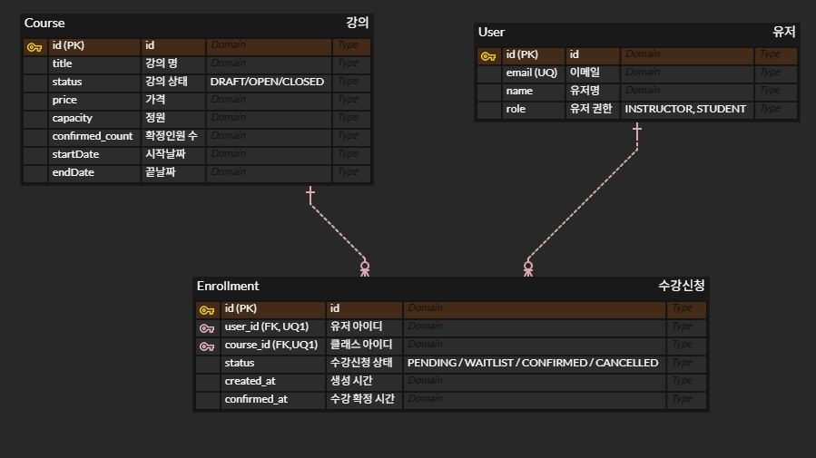

# Class Enrollment System

## 프로젝트 개요

본 프로젝트는 강의 수강 신청 시스템을 구현한 백엔드 애플리케이션입니다.

사용자는 강의를 조회하고 수강 신청을 할 수 있으며,  
결제 확정 과정을 통해 수강이 확정됩니다.  
정원이 초과된 경우에는 대기열(waitlist)에 등록되며,  
수강 취소 시 대기열 사용자에게 기회가 제공됩니다.

---

## 기술 스택

- Language: Java 17
- Framework: Spring Boot
- ORM: Spring Data JPA
- Database: MySQL
- Build Tool: Gradle
- Test: JUnit5

---

## 실행 방법

실행: 
```bash
./gradlew bootRun
```
테스트 실행:

```bash
./gradlew test
```

기본 DB 접속 정보는 application.yml 기준으로 설정되어 있으며,
환경변수(DB_URL, DB_USERNAME, DB_PASSWORD)를 통해 변경할 수 있습니다.

현재 ddl-auto: create 설정으로 인해 애플리케이션 실행 시 테이블이 자동 생성되며, 기존 데이터는 초기화될 수 있습니다.

### 테스트 가이드

- Swagger UI의 API 제목 앞 번호 순서대로 테스트하시면 전체 흐름을 쉽게 확인할 수 있습니다.
- 원활한 테스트를 위해 먼저 사용자 2명을 생성한 뒤 진행하는 것을 권장합니다.
- 첫 번째 사용자는 강사용(`INSTRUCTOR`)으로 생성합니다.
- 두 번째 사용자는 학생용(`STUDENT`)으로 생성합니다.
- 이후 생성된 ID를 활용하여 강의 생성, 수강 신청, 결제 확정 순으로 테스트하시면 됩니다.

Swagger 요청 예시값은 주요 API 기준으로 미리 설정해두어 바로 테스트 가능합니다.

### API 목록

자세한 요청/응답 스펙은 아래 Swagger UI에서 확인 가능합니다.

애플리케이션 실행 후 아래 주소에서 확인 가능합니다.

`http://localhost:8080/swagger-ui/index.html`

User API

| Method | URL           | Description |
| ------ | ------------- | ----------- |
| POST   | `/users`      | 사용자 생성      |
| GET    | `/users/{id}` | 사용자 조회      |

Course API

| Method | URL                 | Description |
| ------ | ------------------- | ----------- |
| POST   | `/courses`            | 강의 생성       |
| GET    | `/courses`            | 강의 목록 조회    |
| GET    | `/courses/{id}`       | 강의 단건 조회    |
| PATCH  | `/courses/{id}/open`  | 강의 오픈       |
| PATCH  | `/courses/{id}/close` | 강의 마감       |


Enrollment API

| Method | URL                         | Description |
| ------ |-----------------------------| ----------- |
| POST   | `/enrollments`              | 수강 신청       |
| GET    | `/enrollments/me?userId=2`  | 내 신청 목록     |
| PATCH  | `/enrollments/{id}/confirm` | 결제 확정       |
| PATCH  | `/enrollments/{id}/cancel`  | 신청 취소       |


### 요구사항 해석 및 가정

명시되지 않은 일부 정책은 아래와 같이 정의하여 구현했습니다.

- 수강 신청 상태는 `PENDING`, `WAITLIST`, `CONFIRMED`, `CANCELLED` 4단계로 관리했습니다.
- 정원(capacity)은 실제 결제가 완료된 `CONFIRMED` 인원 기준으로 계산했습니다.
- `PENDING` 상태는 결제 대기 상태이며, 좌석은 결제 확정 시점에만 점유되도록 설계했습니다.
- 결제 기능은 외부 PG 연동 대신 `결제 확정 API` 호출로 대체했습니다.
- 결제 대기 시간은 30분으로 가정했으며, 이후 만료 처리 대상이 됩니다.
- 수강 취소는 결제 완료 후 7일 이내에만 가능하도록 제한했습니다.
- 동일 사용자의 동일 강의 중복 신청은 허용하지 않았습니다.

## 설계 결정과 이유

### 1. 상태 기반 설계

수강 신청은 상태 전이 기반으로 설계했습니다.

- WAITLIST: 정원 초과 시 대기 상태
- PENDING: 결제 대기 상태
- CONFIRMED: 결제 완료
- CANCELLED: 취소

이를 통해 비즈니스 흐름을 명확하게 표현했습니다.

### 2. 정원 관리 정책

정원은 CONFIRMED 기준으로 관리했습니다.

이유:

- 결제 완료된 사용자만 실제 수강생으로 간주
- 결제 대기(PENDING)는 좌석을 점유하지 않음

### 3. 대기열(waitlist) 설계

대기열은 별도의 테이블이 아닌 Enrollment 상태로 관리했습니다.

- 정원 초과 시 WAITLIST 상태로 생성
- 수강 취소 시 FIFO 방식으로 승격
- 승격 시 WAITLIST → PENDING

### 4. 동시성 처리

결제 확정 시점에 강의 데이터를 `PESSIMISTIC_WRITE` 락으로 조회하도록 설계했습니다.

본 시스템에서는 정원을 `CONFIRMED` 상태 기준으로 관리하기 때문에,
동시에 여러 사용자가 마지막 남은 좌석에 대해 결제 확정을 요청할 경우
정원 초과 확정이 발생할 수 있습니다.

이를 방지하기 위해 결제 확정 로직에서는 강의 row에 쓰기 락을 걸고,
현재 확정 인원과 정원을 다시 검증한 뒤 상태를 `CONFIRMED`로 변경합니다.

낙관적 락도 고려할 수 있지만,
수강 신청 도메인은 특정 강의에 짧은 시간 동안 요청이 몰릴 가능성이 높고,
충돌 발생 시 재시도 로직이 필요해질 수 있습니다.
따라서 이번 과제에서는 데이터 정합성을 우선하여 비관적 락을 선택했습니다.

### 5. 결제 처리 방식

외부 PG 연동은 제외하고, 결제 확정 API로 대체했습니다.

실제 결제 호출은 트랜잭션 외부에서 수행된다고 가정

본 시스템은 결제 성공 이후 상태 변경만 담당

### 6. 중복 신청 방지 정책

동일 사용자가 같은 강의에 여러 번 신청하는 것을 방지하기 위해  
`Enrollment(user_id, course_id)` 복합 유니크 제약을 적용했습니다.

애플리케이션 레벨에서도 중복 신청 여부를 검증하지만,  
동시 요청이나 예외 상황에서도 데이터 정합성을 보장하기 위해  
DB 레벨 제약조건을 함께 적용했습니다.

## 미구현 / 제약사항

- 외부 결제 시스템(PG) 연동 미구현
- 결제 대기(PENDING) 자동 만료 스케줄러 미구현
- 대기열 사용자 알림 기능 미구현
- 분산 환경에서의 동시성 처리 미고려 (단일 인스턴스 기준)

## AI 활용 범위

AI 도구는 코드 작성 보조, 요구사항 정리, 테스트 케이스 검토, README 문서화에 활용했습니다. 결과물은 직접 검토하고 수정하여 반영했습니다.

특히 다음은 직접 설계했습니다:

1. 수강 신청 상태 전이 구조
2. 정원 관리 정책
3. 대기열(waitlist) 처리 방식
4. 동시성 처리 전략

AI가 제안한 내용은 그대로 사용하지 않고,
직접 실행 및 테스트를 통해 검증한 뒤 필요한 부분만 수정·반영했습니다.

## 데이터 모델 설명 (ERD)



## 테스트 검증 항목

- 중복 신청 방지
- 정원 초과 처리
- 대기열 생성 및 승격
- 수강 취소 정책
